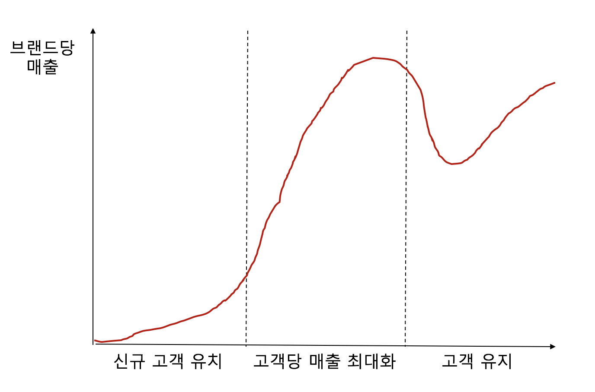
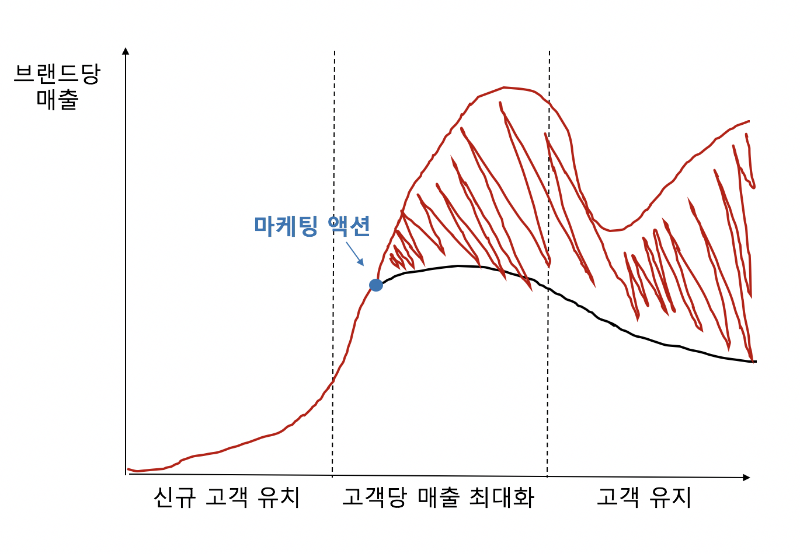
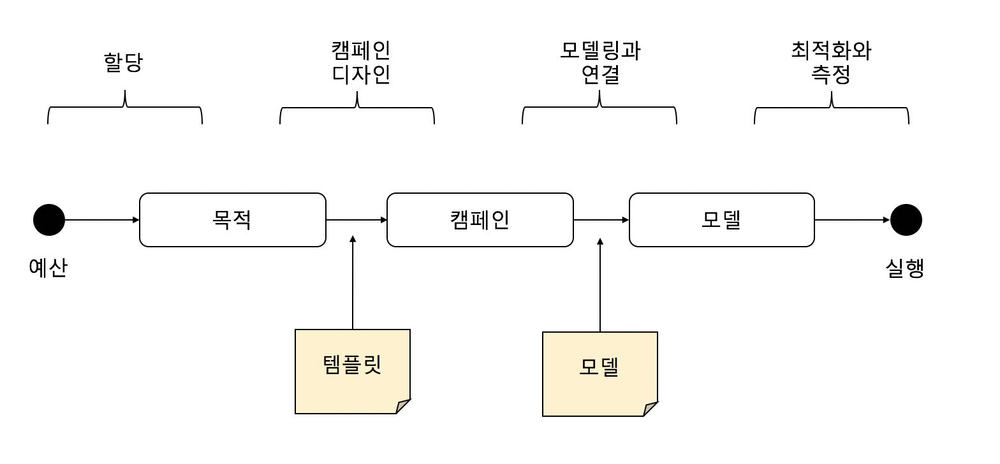

# Algorithm Marketing Study 3  -  Promotion and Advertisement

모든 서비스와 제품은 Target Market 즉, Consumer Group을 가지고 있다

**목표 : Consumer Group과 Offering 사이의 최고의 조합을 찾는 것**  
1. 특정 Consumer Group 에 어떤 offering을 하면 좋을 지 찾는 것 : **Search** 와 **Recommendation**  
2. 특정 Offering 에 맞는 Consumer Group을 찾는 것 : **Targeting**

e.g. Segmentation 의 경우   
- 먼저 Customer Segmentation 을 만들고, best Offering 을 찾는다면 : case 1  
- 먼저 Offering 을 만들고, best Segmentation을 찾는다면 : case 2

## 1. 환경

**목표 :  
1. 매출을 늘린다  
2. 향후 수입을 위해서 고객과의 끈끈함을 유지한다**

위에서 How 에 해당하는 Channel 은 스토어나 이커머스 웹에 해당하는 마케팅 채널을 의미한다.  
여기서 중요한 건 채널은 개인 레벨로 고객을 추적하고 데이터를 제공할 수 있다는 것이다.  

위 타겟팅 시스템에서 캠페인은 보통 아래 3가지 순서로 진행된다

1. **계획** : 목표를 세우고 예산, 기간, **User Group**, **프로모션 종류를 고른다**
2. **실행** : **알맞은 Offering을 제공**하고, 메시지와 캠페인 **타이밍을 지정**하, **캠페인 채널을 결정한**다
3. **측정** : **성과를 측정**한다

여기서 타겟팅 시스템이 결정해야 할것의 예는 다음과 같

1. **계획 단계에서 적합한 프로모션 종류를 제안**
2. **계획 단계에서 적합한 User Group을 추정**
3. **실행 단계에서 알맞은 Offering 을 제공**
4. **실행 단계에서 알맞은 타이밍을 지정**
5. **측정 단계에서 성과를 측정**

\(위 다이어그램은 1개 캠페인의 1개 컴포넌트 환경으로 한정한 것이다.   
다수의 캠페인과 컴포넌트가 엮여있게 되면,  어떤 변수를 취할 것인지 또 어떤 결정을 내릴 것인지 가늠하기 훨씬 어려워진다\)

## 2. 비즈니스의 목적

각 캠페인은 이익과 비용의 차이로 정의되는 양, 즉 **ROI**를 가져야 한다.  
ROI는 캠페인 전에 예측할 수도 있고, 부분적으로나 전체적으로 실행된 이후에 측정될 수도 있다.  
예측 모델에서는 보통 ROI를 캠페인 모수의 함수로 추정한다.

ROI는 명확히 측정하기가 어려운데, 캠페인이 화폐적, 단기적 효과와 더불어 비화폐적, 장기적 효과도 갖고있기 때문이다.

### 제조업체와 소매업체

\(제조업체와 소매업체간 제품 홍보에 한함. 생략\)

### 비용

화폐적 비용의 요소로는 다음과 같은 것들이 있다

1. **유통 비용** : 마케팅 에이전시 비용 등
2. **쿠폰 상환 비용** : 모든 프로모션의 명목 비용이다. 쿠폰 상환 비용 = 전체 프로모션 횟수 x 단일 프로모션의 상환 비용 x 기대 상환 비용
3. **클리어링 하우스 비용** : 현물 쿠폰의 경우 수거한 쿠폰들을 따로 제삼자 클리어링 하우스로 보내고 처리하는 작업이 있는데, 해당 비용을 말한다

비화폐적 비용의 요소중 하나로, 과도한 이메일로 인한 고객의 이메일 피로감을 꼽을 수 있다.  
이메일을 너무 자주 보내거나 상관없는 이메일을 보내는 경우 \(OA message\) 이메일을 열어보는 비율이 감소하고 고객 불만을 증가시킨다.  
이것을 화폐적 비용처럼 직접적으로 계산하기는 힘들지만 매출이나 마케팅 액션과 연관지어서 간접적으로 측정하는 것은 가능하고, 이를 순이익 계산에 반영할 수 있다.

### 이익

이익은 여러 측면에서 분석할 수 있는데, 가장 기본적인 건 매출의 증대이다

$$
profit = Q(P - V) - C
$$

_Q : 판매량  
P : 단위 당 판매 가격  
V : 단위 당 변동 캠페인 비용  
C : 고정 캠페인 비용_

프로모션이 있었을 때 판매량을 Qc, 없었을 때 판매량을 Qo 라 하면

$$
Qc(P - V) - C > Qo * P
$$

이면 성공이라 볼 수 있다.

보통 고객과 브랜드의 관계는 다음의 3단계로 나뉘며 때로는 반복된다

1. 소비자는 처음에는 특정 브랜드에 관심이 없고 다른 브랜드 또는 다른 제품의 카테고리를 선호한다. 여기서 목표는 새로운 고객을 만드는 것이다
2. 브랜드와 접촉이 있는 고객은 보다 많은 제품을 구입할 수 있는 인센티브를 제공받는다. 이런 고객들에 대한 캠페인은 보통 up-sell 또는 cross-sell 기법을 사용한다. up-sell : 평소에 구매하는 제품의 양보다 많이 구입하도록 유도 cross-sell : 관련된 제품에 대한 인센티브를 제공
3. 마지막으로 고객은 브랜드와의 접촉을 멈출 수 있다. 이는 보통 고객 감소, 고객 전향 또는 고객 이탈이라고 한다. 기존 고객의 유지 비용은 보통 신규 고객 유치 비용보다 저렴하므로 브랜드는 고객을 잃기 전에 특별한 가격을 제공할 수 있다

각각의 phase 에 대해 비즈니스 목표는 다음과 같다

1. 첫 번째 단계에 있는 고객은 고객 유치를 위한 캠페인을 통해 고객으로 유치되어야 한다
2. 두 번째 단계에 있는 고객은 소비를 극대화하기 위해 인센티브가 제공되어야 한다
3. 브랜드를 떠나기 직전의 고객은 적시에 판별되고 또 유지되어야 한다

그래서 프로모션은 단기적인 이익과 더불어 아래와 같은 장기적인 이익을 유도하도록 설계되는 것이 바람직하다

## 3. 타겟팅 파이프라인

1. 먼저 예산을 할당한다. 여기서는 목적들이 무엇인지 정의하고 각 목적들이 예산에 대비해서 어떻게 균형을 이룰 수 있을지 고민한다.
2. 각 목적들\(A의 신규 고객 유치, B의 기존 고객 유지 \)에 대해 캠페인을 디자인한다. 
3. 예측 모델과 캠페인을 연결한다. 각 캠페인에 대해 타겟될 고객, 시각, 메시지 등과 같은 것을 결정한.
4. 마지막으로 추가 최적화와 결과 측정에 사용할 데이터를 수집한다.

## 4. 응답 모델링과 측정

